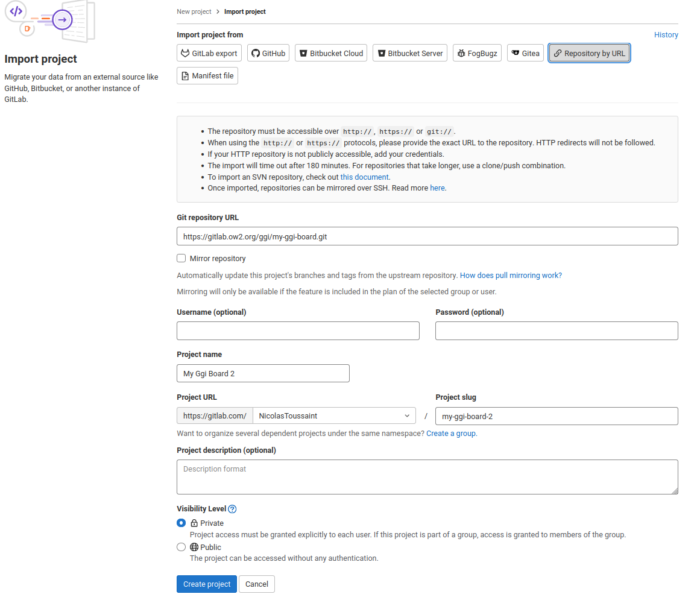
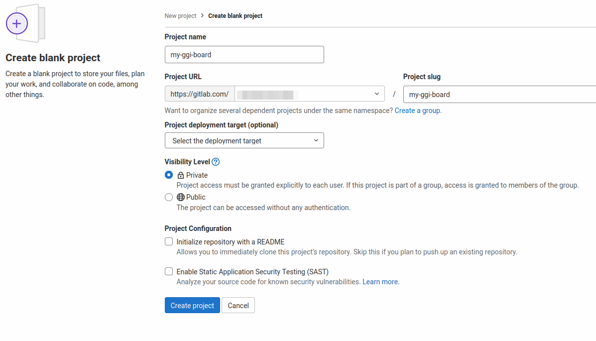
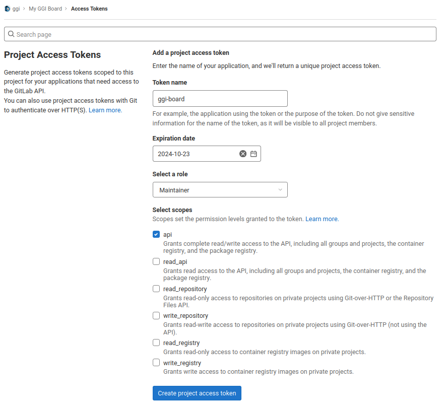
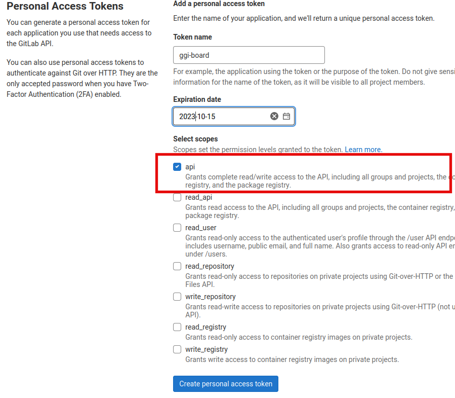
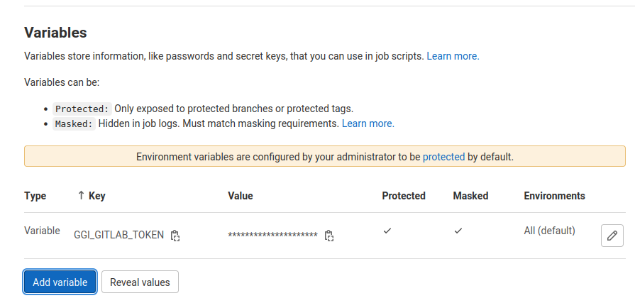
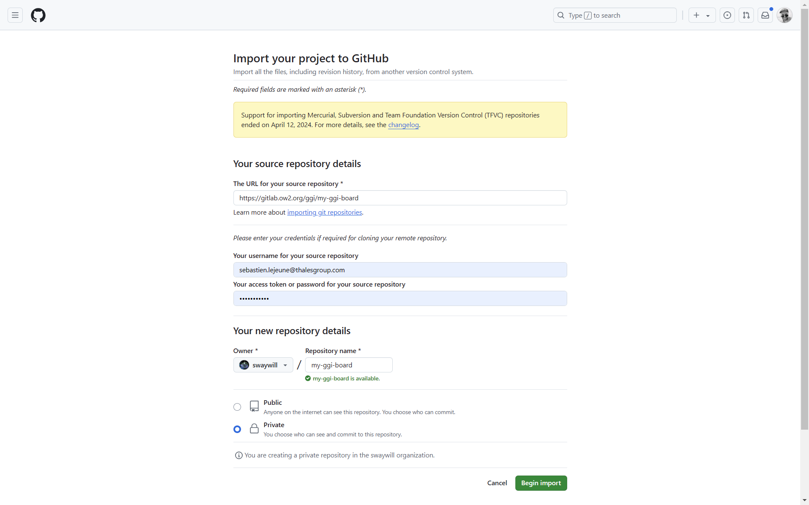
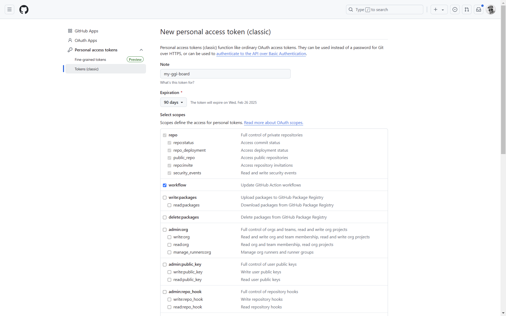
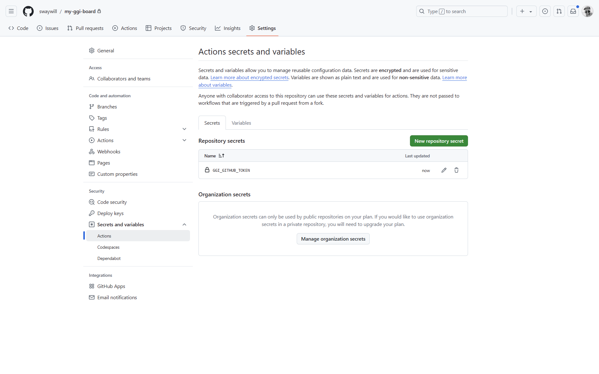
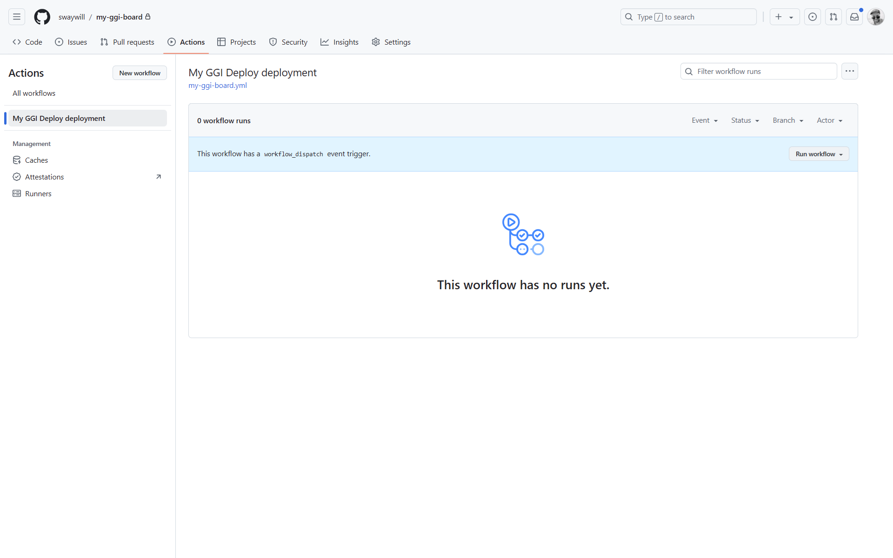

This is the home of your own **Good Governance Initiative tracking board**.

# Introduction

This project helps implementing the [Good Governance Initiative (GGI)](https://ospo-alliance.org/ggi) framework.  
The GGI framework is a guide to effectively implement, step by step, an Open Source Program Office in your organisation. It proposes 25 activities organised in 5 distinct goals.


The goal is
- to fork the [my-ggi-board repository](https://gitlab.ow2.org/ggi/my-ggi-board) in your own GitLab/GitHub space.
- fill the configuration file - including a GitLab/GitHub token
- then run a script that will automatically create
  - appropriate labels
  - GitLab/GitHub Issues that will stand for the GGI activities
  - an Issues Board for a clear overview of you current activities (still work in progress for GitHub)
  - a static website to share progress and current work

# How it works

Currently the deployment is supported on the following platforms:
- [GitLab](https://gitlab.com)
- [GitHub](https://github.com)

## GitLab deployment

### Fork the repository
Multiple options here: 
- use the Import feature proposed by GitLab
- fork manually.

**GitLab Import Project**  
Probably simpler, but be aware that all branches will be duplicated to you own repo.

In your own GitLab space:
- Create a new project
- Choose: _Import project_
- Choose: _Repository by URL_
- Enter `https://gitlab.ow2.org/ggi/my-ggi-board.git`
- Adjust parameters (project url, slug and visibility level)
- Click: _Create project_

    


**Manually Fork**  
1. Create an empty project on your target GitLab instance.

    

1. Clone the [my-ggi-board repository](https://gitlab.ow2.org/ggi/my-ggi-board) to your new project.

To do so, clone the my-ggi-board repository locally, and add the new project's reference to the remotes:
```
$ git clone https://gitlab.ow2.org/ggi/my-ggi-board.git
$ git remote add my-ggi-board git@gitlab.com:<your-gitlab-space>/my-ggi-board.git
$ git push my-ggi-board
```

### Create your GitLab token

Two possibilities to create your [GitLab token](https://docs.gitlab.com/ee/security/tokens/index.html), depending on your GitLab environment: use a [Project access tokens](https://docs.gitlab.com/ee/user/project/settings/project_access_tokens.html#project-access-tokens) of a [Personal access tokens](https://docs.gitlab.com/ee/user/profile/personal_access_tokens.html)

**Project access tokens**  
Create an access token (Project settings > Access Tokens) with the `api` privilege and with role `Maintainer`. Remember it, you will never see it again.



**Personal access tokens**  
In case the instance admin has disabled the _project_ access token, you can use an _personal_ access token, although we recommend creating a dedicated account for security purposes in that case. Go to Preferences > Access Tokens and create the token from there.



### Setup the environment

1. Edit the file in `conf/ggi_deployment.json`, and set the variables `gitlab_url` (such as `https://gitlab.com`) and `gitlab_project` (such as `ggi/my-ggi-board-test`)
1. Commit and publish that file to your repository
1. Export the access token as an environment variable: `export GGI_GITLAB_TOKEN=xxxxxxx`.
1. Enable CI/CD feature for the project : go to Settings > Visibility, project features, permissions > CI/CD and save changes
1. Configure GitLab Pages feature for the project : go to Deploy > Pages, uncheck 'Use unique domain' and Save changes
1. Create a CI/CD env variable: go to Settings > CI/CD > Variables, then add a variable named `GGI_GITLAB_TOKEN` and set the access token as the value. Make it `Masked and hidden` (will not be shown in Jobs logs and revealed once set), `Protected` (cannot be used in non-protected branches) and non-expandable. 

     

1. Run the pipeline: go to Build > Pipelines, click on the button 'New Pipeline' and then click on the button 'Run Pipeline'
1. Once the pipeline is over, you are done, your dashboard is ready !


## GitHub deployment

### Fork the repository
Multiple options here: you may want, for example, to use the Import feature proposed by GitHub, or fork manually.

**GitHub Import Project**
Probably simpler, but be aware that all branches will be duplicated to you own repo.

In your own GitHub space:
- Create a new project
- Choose: _Import project_
- In 'The URL for your source repository' field, enter `https://gitlab.ow2.org/ggi/my-ggi-board.git`
- Choose the owner and the repository name
- Click on _Begin import_

    

**Manually Fork**

1. Create an empty project on your target GitHub instance.
1. Clone the [my-ggi-board repository](https://gitlab.ow2.org/ggi/my-ggi-board) to your new project.

To do so, clone the my-ggi-board repository locally, and add the new project's reference to the remotes:
```
$ git clone https://gitlab.ow2.org/ggi/my-ggi-board.git
$ git remote add my-ggi git@github.com:<your-GitHub-space>/my-ggi-board.git
$ git push my-ggi-board
```

### Create your GitHub token

**Personal access tokens**  
1. Go to Settings > Developer setting > Personal access tokens > Tokens (classic).
1. Click on 'Generate a new token' then 'Generate new token (classic)'
1. Name it 'my-ggi-board', choose an expiration and select scopes 'Repo' and 'Workflow'
1. Click on 'Generate token'

    

### Setup the environment

1. Edit the file in `conf/ggi_deployment.json`, and set the variables `github_url` (such as `https://github.com`) and `github_project` (such as `my-ggi-board`)
1. Commit and publish that file to your repository
1. Go to repository Settings > General > Features and enable 'Issues' and 'Projects'. 
1. Create a GitHub Actions env variable: go to Settings > Secrets and Variables > Actions, then add a new repository secret named `GGI_GITHUB_TOKEN` and set the access token as the value. Click on 'Add secret'.

     
   
1. Execute the GitHub action workflow called 'My GGI Deploy deployment' by clicking on 'Run the workflow' button. This will:
  - Create labels, activities and board.
  - Setup the static website configuration.
  - Replace the URL in the description.
  - Update the website's content.
  - Publish the result on GitHub pages.

     