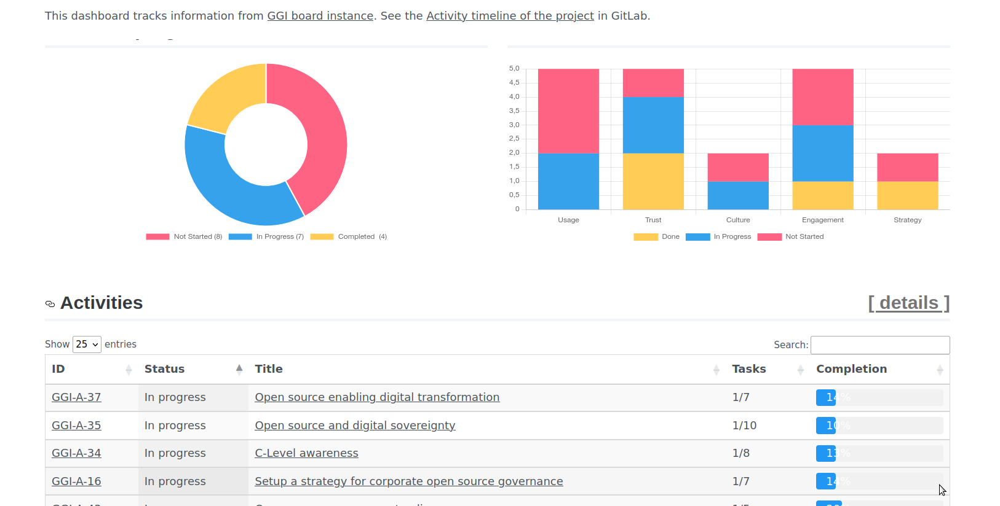
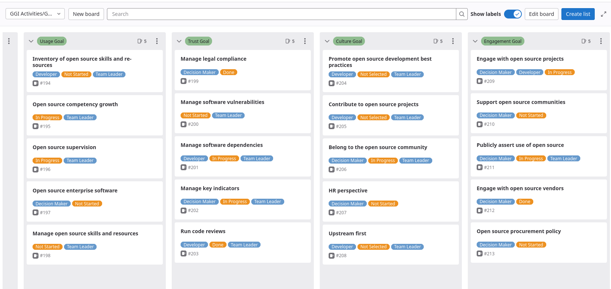

This is the home of your own Good Governance Initiative tracking board.

This project helps implementing the [Good Governance Initiative (GGI)](https://ospo.zone/ggi) framework.
The GGI framework is a guide to effectively implement, step by step, an Open Source Program Office in your organisation. It proposes 25 activities organised in 5 distinct goals.

The goal here is, within a few minutes, to set up a simple environment that helps:
- select the activities you want to focus on
- describe _how_ it applies to your situation
- set a list of objectives for each Activity
- track your progress via a simple web page (hosted within GitLab pages)
- orgnise tasks with your team
- easily share your progress

Everything can we put in place from the GitLab web interface, in 3 steps:
1. Fork this repository in your GitLab ([gitlab.com](https://gitlab.com) or your own instance)
2. Create an Access Token and configure a new CI/CD Variable in GitLab
3. Execute a pre-configured pipeline manually, only once.

This is what you get:
- An Issue per GGI Activity
- An Issue Board to organise your work
- A static Dashboard that report your current activity and progress, refreshed overnight by a scheduled pipeline.

To find out of to deploy the My-GGI-Board, see [docs/getting-started.md]

Example of Dashbord:

Example of Issue Board:

