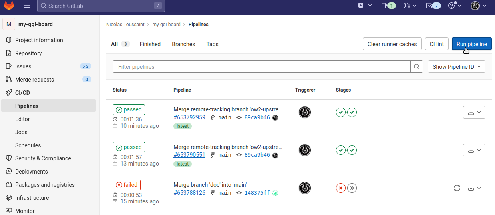

# Welcome

This is the home of your own Good Governance Initiative tracking board.

The set up steps are:
- fork the [my-ggi-board repository](https://gitlab.ow2.org/ggi/my-ggi-board) in your own GitLab space.
- create a GitLab Token, configure a CI Variable [GGI_GITLAB_TOKEN](https://docs.gitlab.com/ee/ci/variables/#add-a-cicd-variable-to-a-project)
- run the configured pipeline, that will create:
  - appropriate labels
  - GitLab Issues that stand for the GGI activities
  - an Issues Board for a clear overview of you current activities
  - a static website, the Dashboard, to share progress and current work

## Setup

### Fork the repository
Multiple options here: you may want, for example, to use the Import feature proposed by GitLab, or fork manually.

#### Manual Fork
- Create an empty project on your target GitLab instance.


- Clone the [my-ggi-board repository](https://gitlab.ow2.org/ggi/my-ggi-board) to your new project.

To do so, clone the my-ggi-board repository locally, and add the new project's reference to the remotes:
```
$ git clone https://gitlab.ow2.org/ggi/my-ggi-board.git
$ cd my-ggi-board
$ git remote add my-ggi git@gitlab.com:<your-gitlab-space>/my-ggi-board.git
$ git push my-ggi
```
**After you have pushed**, the pipeline will be triggered and will fail: this is expected, as the `GGI_GITLAB_TOKEN` variable has not been defined yet, see below.

#### Import Project
This does not require cloning the GGI repository locally, but be aware that all branches will be duplicated to you own repo.

In your own GitLab space:
- Create a new project
- Choose: _Import project_
- Choose: _Repository by URL_
- Enter `https://gitlab.ow2.org/ggi/my-ggi-board.git`


### Create your GitLab token
Two possibilities to create your [GitLab token](https://docs.gitlab.com/ee/security/token_overview.html), depending on your GitLab environment: use a [Project access tokens](https://docs.gitlab.com/ee/user/project/settings/project_access_tokens.html#project-access-tokens) of a [Personal access tokens](https://docs.gitlab.com/ee/user/profile/personal_access_tokens.html)

**Project access tokens**  
Create an access token (Project settings > Access Tokens) with the `api` privilege and with role `Maintainer`. Remember it, you will never see it again.


**Personal access tokens**  
In case the instance admin has disabled the _project_ access token, you can use an _personal_ access token, although we recommend creating a dedicated account for security purposes in that case. Go to Preferences > Access Tokens and create the token from there.


### Configure and run the pipeline
Create a CI/CD env variable: go to Settings > CI/CD > Variables, then add a variable named `GGI_GITLAB_TOKEN` and set the access token as the value. Make it `Protected` (cannot be used in non-protected branches) and `Masked` (will not be shown in Jobs logs.)
 

To  initiate the deployment, and then update the Dashboard, you may execute the pipeline manually: Browse to _CI/CD_, _Pipelines_, and click on _Run pipeline_:


You can also schedule the pipeline to be triggered regularly, every night for example.

## Notes

* Prerequisites for Python are registered in `requirements.txt`. You are encouraged to create a virtual environment to execute the scripts, althought it is not required.
* GitLab CE doesn't allow to create Boards through the API.

## Testing

The `ggi_test_scenario.py` script takes as argument a GitLab instance URL and a project ID, executes the creation scripts and then checks that everything is in its right place.
